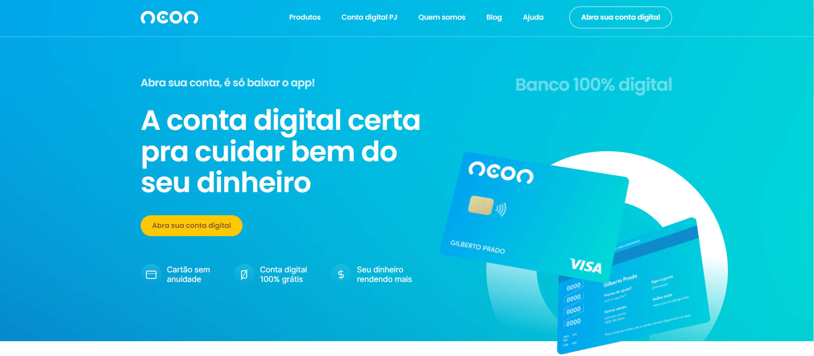

# heitorcallipo.github.io

REDESIGN NEON LANDING PAGE

🚀 Nome do projeto: Redesign LP Neon

🎯 Objetivo principal: Recriar a interface da landing page do banco NEON com foco primordial na precisão do design oficial do FIGMA.

🔧 Skills e funcionalidades utilizadas:

✅ Integração com WordPress para um gerenciamento aprimorado.

✅ Pixel-perfect para assegurar a fidelidade ao design.

✅ Implementação de boas práticas de layout, com ênfase na responsividade.

✅ Utilização da biblioteca AOS Animation para animar elementos da página.

✅ Emprego de keyframes CSS para efeitos visuais impactantes.

[SCREENSHOT]

