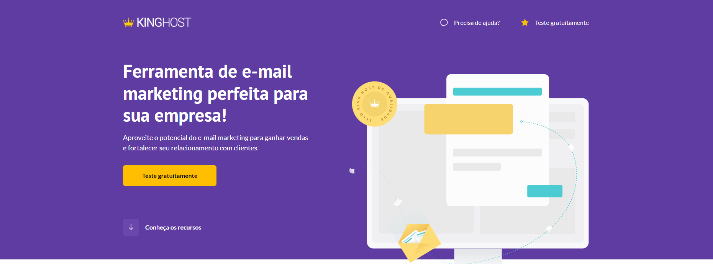
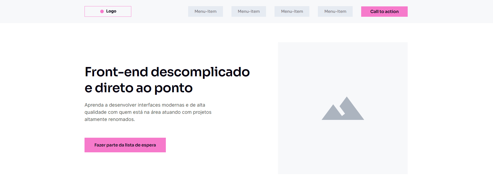

# heitorcallipo.github.io

[ENGLISH]

🚀 Redesign Neon LP - Project

🎯 Main objective: Recreate the interface of the NEON bank landing page with a primary focus on accurately matching the official FIGMA design.

🔧 Skills and functionalities used:

✅ Integration with WordPress for enhanced management.

✅ Pixel-perfect implementation to ensure fidelity to the design.

✅ Implementation of good layout practices with emphasis on responsiveness.

✅ Utilization of the AOS Animation library to animate page elements.

✅ Use of CSS keyframes for impactful visual effects.

🌟 Developed by Heitor as part of the Codeboost course.

[PORTUGUÊS]

🚀 Redesign Neon LP - Projeto

🎯 Objetivo principal: Recriar a interface da landing page do banco NEON com foco primordial na precisão do design oficial do FIGMA.

🔧 Skills e funcionalidades utilizadas:

✅ Integração com WordPress para um gerenciamento aprimorado.

✅ Pixel-perfect para assegurar a fidelidade ao design.

✅ Implementação de boas práticas de layout, com ênfase na responsividade.

✅ Utilização da biblioteca AOS Animation para animar elementos da página.

✅ Emprego de keyframes CSS para efeitos visuais impactantes.

🌟 Desenvolvido por Heitor como parte do curso Codeboost.

[SCREENSHOT]

[ENGLISH]

🚀 Kinghost Landing Page - Project

🎯 Main objective: This project aims to enhance and apply the knowledge acquired in the SASS module during the Codeboost course.

🔧 Skills and functionalities used:

✅ Application of advanced SASS techniques to improve code organization and reusability.

✅ Implementation of a pixel-perfect layout to ensure fidelity to the original design.

✅ Utilization of good web development practices to ensure code quality and efficiency.

✅ Responsiveness and compatibility with different devices and browsers.

✅ Integration of interactive features and animations to enhance the user experience.

🌟 Developed by Heitor as part of the Codeboost course.

[PORTUGUÊS]

🚀 Kinghost Landing Page - Projeto

🎯 Objetivo principal: Este projeto tem como objetivo aprimorar e aplicar os conhecimentos adquiridos no módulo de SASS durante o curso Codeboost.

🔧 Skills e funcionalidades utilizadas:

✅ Aplicação de técnicas avançadas de SASS para melhorar a organização e reutilização do código.

✅ Implementação de um layout pixel-perfect para garantir a fidelidade ao design original.

✅ Utilização de boas práticas de desenvolvimento web para garantir a qualidade e eficiência do código.

✅ Responsividade e compatibilidade com diferentes dispositivos e navegadores.

✅ Integração de recursos interativos e animações para melhorar a experiência do usuário.

🌟 Desenvolvido por Heitor como parte do curso Codeboost.

[SCREENSHOT]

[ENGLISH]

🚀 Wireframe Landing Page - Project

🎯 Main objective: This project aims to enhance and apply the knowledge acquired in the basic layout module during the Codeboost course.

🔧 Skills and functionalities used:

✅ Deepening knowledge of good layout practices to create a well-organized and appealing structure.

✅ Implementation of a pixel-perfect layout to ensure fidelity to the original design and provide a consistent visual experience.

✅ Utilization of good web development practices, such as semantic HTML structure, optimized CSS styles, and clean code, to ensure project quality and efficiency.

✅ Responsiveness and compatibility with different devices and browsers, ensuring the page adapts perfectly to screens of various sizes and functions correctly in different environments.

✅ Integration of interactive features and animations to enhance the user experience, making navigation more engaging and intuitive.

✅ Performance optimization, applying techniques such as image compression, asynchronous resource loading, and code optimization, to ensure fast loading times and a smooth user experience.

✅ Use of Search Engine Optimization (SEO) techniques to improve the page's visibility and ranking in search engines, increasing its relevance and attracting more visitors.

🌟 Developed by Heitor as part of the Codeboost course.

[PORTUGUÊS]

🚀 Wireframe Landing Page - Projeto

🎯 Objetivo principal: Este projeto tem como objetivo aprimorar e aplicar os conhecimentos adquiridos no módulo básico sobre layout durante o curso Codeboost.

🔧 Skills e funcionalidades utilizadas:

✅ Aprofundar os conhecimentos sobre boas práticas de layout para criar uma estrutura bem organizada e atraente.

✅ Implementação de um layout pixel-perfect para garantir a fidelidade ao design original e proporcionar uma experiência visual consistente.

✅ Utilização de boas práticas de desenvolvimento web, como estrutura semântica HTML, estilos CSS otimizados e código limpo, para garantir a qualidade e eficiência do projeto.

✅ Responsividade e compatibilidade com diferentes dispositivos e navegadores, assegurando que a página se adapte perfeitamente a telas de diversos tamanhos e funcione corretamente em diferentes ambientes.

✅ Integração de recursos interativos e animações para aprimorar a experiência do usuário, tornando a navegação mais envolvente e intuitiva.

✅ Otimização de desempenho, aplicando técnicas de compressão de imagens, carregamento assíncrono de recursos e otimização de código, para garantir um tempo de carregamento rápido e uma experiência ágil para o usuário.

✅ Uso de técnicas de SEO (Search Engine Optimization) para melhorar a visibilidade e a classificação da página nos motores de busca, aumentando sua relevância e atraindo mais visitantes.

🌟 Desenvolvido por Heitor como parte do curso Codeboost.

[SCREENSHOT]

